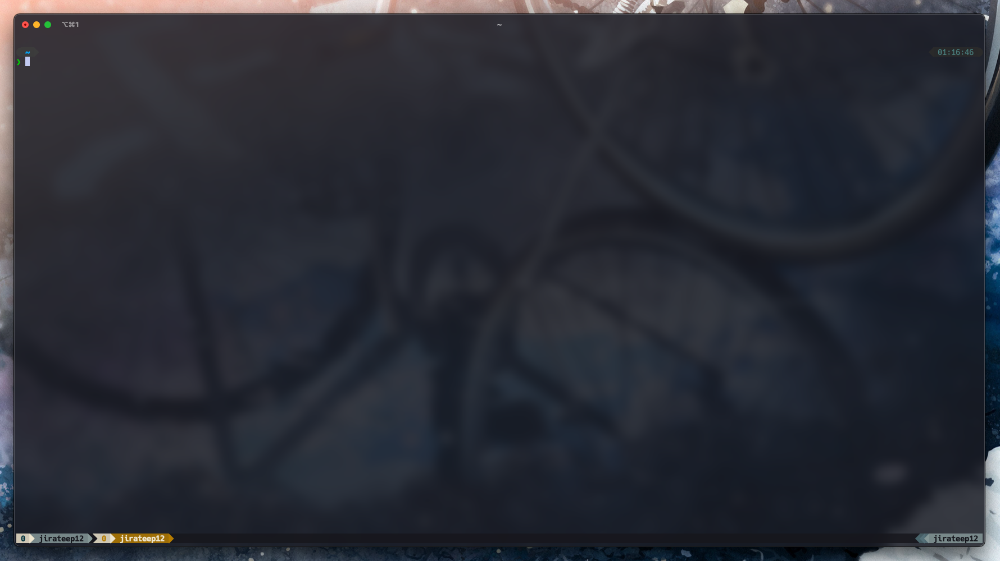

# Jirateep's dotfiles

Hey there 👋 these are the dotfiles i use every day to make my work life easier. I'm always tinkering with them and finding cool new tricks to speed things up. While these tools are my personal favorites, i thought i'd share them with you - who knows, you might find some hidden gems in here too feel free to poke around and borrow any ideas that catch your eye. And hey, if you've got any awesome tips of your own, i'd love to hear them.

Warning: Don’t blindly use my settings unless you know what that entails. Use at your own risk.



## Setup (macos/linux)

```zsh
# Check if git is already installed by running this command in terminal:
git --version

# If git is not installed, install it using homebrew:
# Install homebrew:
/bin/bash -c "$(curl -fsSL https://raw.githubusercontent.com/Homebrew/install/HEAD/install.sh)"

# Install git using homebrew:
brew install git

# After installing git, close and reopen terminal to use git commands

# Clone the dotfiles git repository to your home directory:
git clone https://github.com/jirateep12z/dotfiles-public.git $HOME/.dotfiles

# Set the execution permission to allow running the install script:
chmod +x $HOME/.dotfiles/*.sh

# Run the install script to set up the dotfiles:
~/.dotfiles/install.sh

# After running the install script, install fisher (a plugin manager for fish shell):
~/.dotfiles/fisher.sh
```

## Setup (windows)

```powershell
# Check if git is already installed by running this command in windows powershell:
git --version

# If git is not installed, install it using scoop:
# Allow running scripts from the internet:
set-executionpolicy -executionpolicy remotesigned -scope currentuser

# Download and install scoop:
invoke-restmethod -uri https://get.scoop.sh | invoke-expression

# Install git using scoop:
scoop install git

# After installing git, close and reopen windows powershell to use git commands

# Clone the dotfiles git repository to your home directory:
git clone https://github.com/jirateep12z/dotfiles-public.git $ENV:USERPROFILE/.dotfiles

# Set the execution policy to allow running the install script:
set-executionpolicy -executionpolicy remotesigned -scope currentuser

# Run the install script to set up the dotfiles:
~/.dotfiles/install.ps1
```
